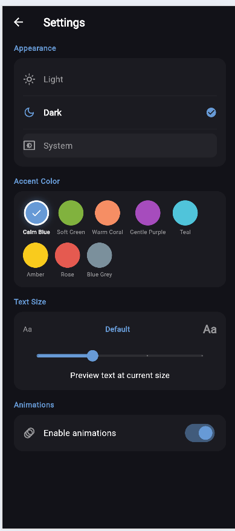
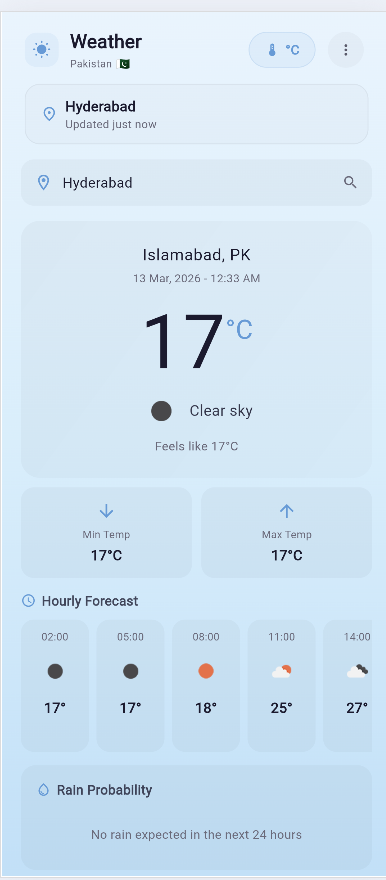
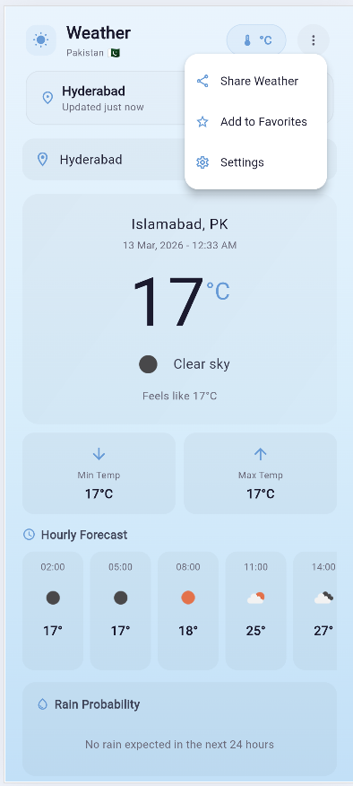
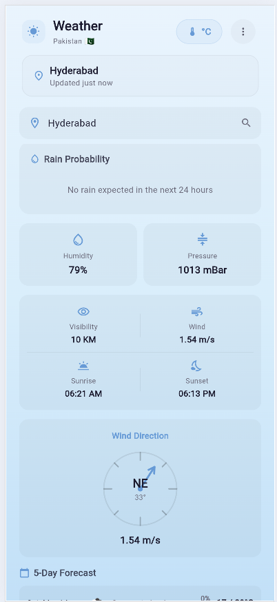
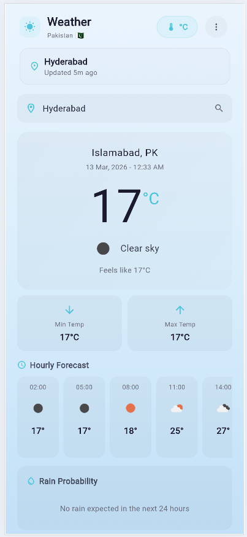

# Weather App

A sleek and intuitive weather application built with Flutter, delivering real-time weather information for cities worldwide.

<p align="center">
  
  
  
</p>

---

## ✨ Features

- **Real-time Weather:** Get up-to-the-minute weather data for any city.
- **Detailed Forecast:** View temperature, humidity, wind speed, and more.
- **Hourly & 5-Day Forecast:** Plan your week with detailed hourly and daily forecasts.
- **City Search:** Easily search for and add new cities.
- **Favorites:** Save your favorite cities for quick access.
- **Dynamic UI:** A clean and responsive interface that adapts to all screen sizes.
- **Customization:** Personalize the app with different themes and accent colors.
- **Secure API Key:** Your API key is kept safe and is not exposed in the codebase.

---

## 📸 Screenshots

| | | |
|:---:|:---:|:---:|
|  |  |  |
| **Home Screen** | **Weather Details** | **Settings** |
|  |  |  |
| **Light Mode** | **Menu Options** | **More Details** |
|  | | |
| **Updated Status** | | |

---

## 🛠️ Tech Stack

| Category | Technology |
|:---|:---|
| **Framework** | Flutter (Dart) |
| **State Management** | Provider |
| **HTTP Client** | Dio |
| **API** | OpenWeatherMap |
| **Architecture** | Service-Oriented Architecture |

---

## 🚀 Getting Started

### Prerequisites

- Flutter SDK (`>=3.0.0`)
- An [OpenWeatherMap API key](https://openweathermap.org/appid)

### Installation

1.  **Clone the repository:**
    ```bash
    git clone https://github.com/your-username/weather-app.git
    cd weather-app
    ```

2.  **Install dependencies:**
    ```bash
    flutter pub get
    ```

### Configuration

1.  Create a `config.json` file in the `assets` directory from the template:
    ```bash
    cp assets/config.template.json assets/config.json
    ```

2.  Add your OpenWeatherMap API key to `assets/config.json`:
    ```json
    {
      "baseUrl": "https://api.openweathermap.org/data/2.5",
      "appId": "YOUR_API_KEY"
    }
    ```
    > **Note:** The `config.json` file is included in `.gitignore` to protect your API key.

### Run the App

```bash
flutter run
```

---

## 📂 Project Structure

```
lib/
├── main.dart
├── config/
│   ├── build_config.dart
│   └── env_config.dart
├── core/
│   ├── app_colors.dart
│   ├── app_utils.dart
│   ├── favorites_manager.dart
│   ├── text_style.dart
│   ├── theme_provider.dart
│   └── weather_helpers.dart
├── network/
│   ├── api_interceptor.dart
│   ├── dio_client.dart
│   ├── WeatherApi.dart
│   └── WeatherApiImpl.dart
└── ui/
    ├── home/
    ├── settings/
    └── splash/
```

---

## 📄 License

This project is licensed under the MIT License - see the [LICENSE](LICENSE) file for details.

---

## 👨‍💻 Author

**Anees**

- **GitHub:** [@Anees040](https://github.com/Anees040)

