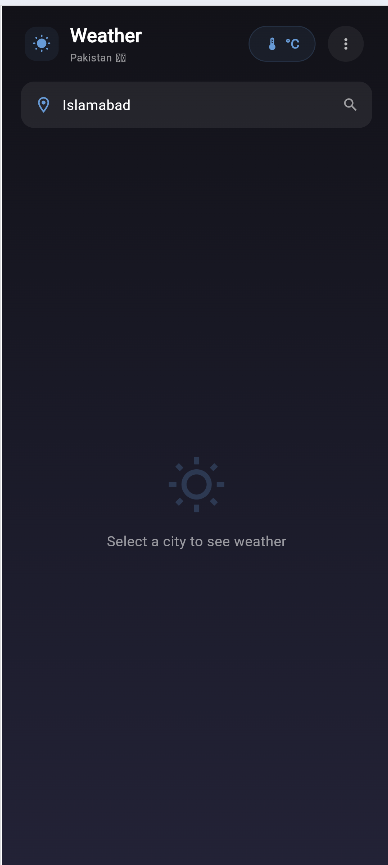
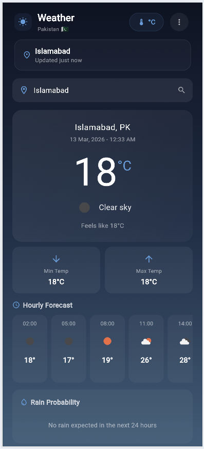

# Weather Forecast Pakistan

A modern, responsive weather forecast application built with **Flutter**, providing real-time weather data for major cities across Pakistan. Powered by the [OpenWeatherMap API](https://openweathermap.org/api).

---

## Features

- Real-time weather data for **15 major Pakistani cities**
- Temperature, humidity, pressure, visibility, and wind speed
- Sunrise & sunset times
- Clean, dark-themed UI with gradient backgrounds
- Fully responsive — works on all screen sizes without overflow
- Secure API key management (config file excluded from version control)

---

## Screenshots

| Home Screen | Weather View |
|:-----------:|:------------:|
|  |  |

---

## Tech Stack

| Layer        | Technology                          |
|:-------------|:------------------------------------|
| Framework    | Flutter (Dart)                      |
| HTTP Client  | Dio 5.x                             |
| API          | OpenWeatherMap — Current Weather    |
| State Mgmt   | StatefulWidget                      |
| Architecture | Service-based with Interceptors     |

---

## Getting Started

### Prerequisites

- Flutter SDK `>=3.0.0`
- A free [OpenWeatherMap](https://openweathermap.org/appid) API key

### Installation

```bash
git clone https://github.com/Anees040/weather-forecast-pk.git
cd weather-forecast-pk
```

### Configuration

1. Copy the template config:
   ```bash
   cp assets/config.template.json assets/config.json
   ```

2. Open `assets/config.json` and add your API key:
   ```json
   {
     "baseUrl": "https://api.openweathermap.org/data/2.5",
     "appId": "YOUR_OPENWEATHERMAP_API_KEY"
   }
   ```

> **Note:** `assets/config.json` is listed in `.gitignore` — your API key will never be committed.

### Run

```bash
flutter pub get
flutter run
```

---

## Project Structure

```
lib/
├── main.dart                  # App entry point & config loader
├── config/                    # Build & environment configuration
├── core/                      # Colors, text styles, utilities
├── network/                   # Dio client, API interface & interceptors
└── ui/home/
    ├── model/                 # City, WeatherData, WeatherResponse
    ├── view/                  # HomePage (main screen)
    └── widget/                # Reusable UI components
```

---

## Supported Cities

Islamabad · Karachi · Lahore · Peshawar · Multan · Faisalabad · Quetta · Rawalpindi · Hyderabad · Sialkot · Gujranwala · Bahawalpur · Abbottabad · Sukkur · Larkana

---

## API Reference

This app uses the [OpenWeatherMap Current Weather API](https://openweathermap.org/current).

- **Endpoint:** `GET /weather?id={city_id}&units=metric&appid={key}`
- **Rate Limit:** 60 requests/minute (free tier)
- **Response:** JSON with temperature, conditions, wind, humidity, sunrise/sunset

---

## License

This project is open source and available under the [MIT License](LICENSE).

---

## Author

**Anees** — [GitHub](https://github.com/Anees040)
